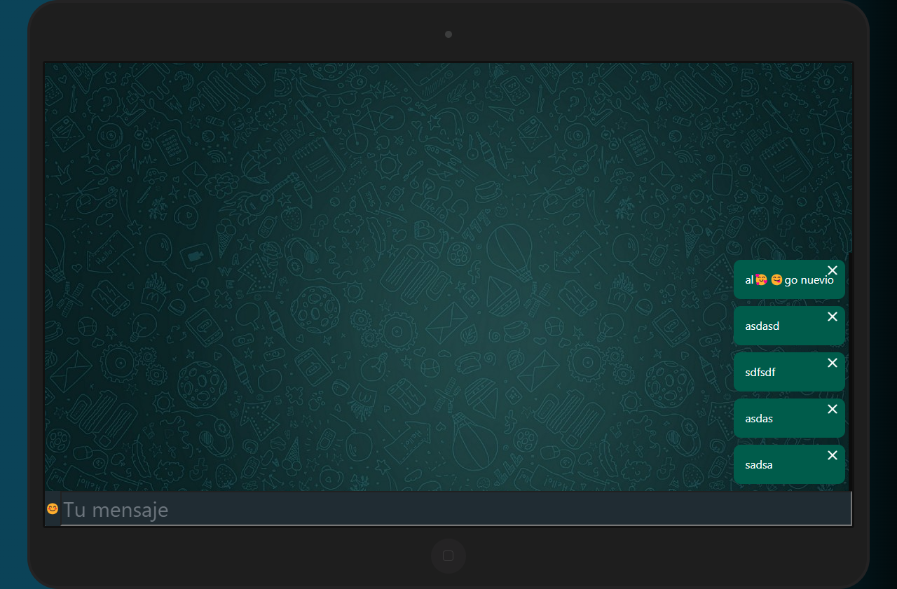

# Emoji selector
> Aplicación de selector de emojis utilizando useRef

## Built with 

- JavaScript
- React.JS 18
- Vercel
- HTML + CSS
- Emoji-API

## Live demo

[Live demo link](https://emoji-selector-km.vercel.app/)

## Run it locally

 ### Setup

 - Clone this repo using `git clone https://github.com/khabLexander/emojiSelector`

 ### Comands

 - `npm i`
 - `npm start`

## 👤 Author

 **Kevin Alexander Mantilla G**

- GitHub: [@khabLexander](https://github.com/khabLexander)
- Twitter: [@Khabin14](https://twitter.com/Khabin14)
- LinkedIn: [Kevin Alexander Mantilla](https://www.linkedin.com/in/kevin-alexander-mantilla-3238a5213/)

## 🤝 Contributing

- **Juan Sebastian Sotomayor**

- [Vida MRR Programación web](https://www.youtube.com/watch?v=oT-feDPuJmk&t=5148s&ab_channel=VidaMRR-Programacionweb/)

## 🤲 Show your support

- Give me a ⭐ if you like it!

